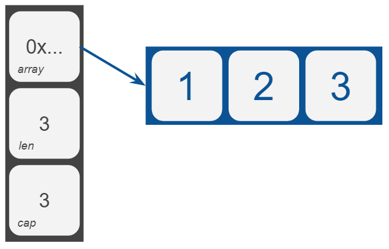
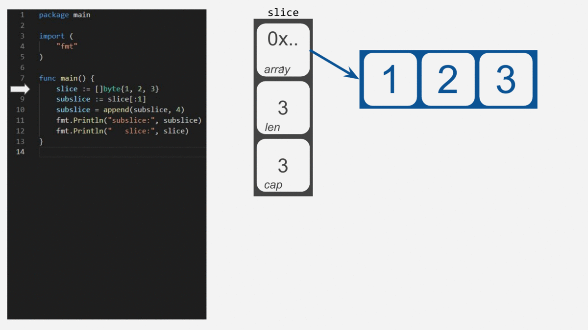

# Arrays and Slices
_see code [here](underlying_memory_block.go)_

## Array

Arrays are just continuous blocks of memory. We can simply represent array as a set of blocks in memory sitting next to each other.

```Go
var arr [3]byte
var arr = [3]byte{1, 2, 3}
var arr = [...]byte{1, 2, 3}
```

<p align="center"></p>

## Slice

Slices are similar to arrays, even their declaration is really similar:

```Go
var slice []byte
var slice = []byte{1, 2, 3}
```

However, slices are defined in Go as a structure with three fields - pointer to array, length and capacity:

```Go
type slice struct {
    array unsafe.Pointer
    len   int
    cap   int
}
```

Click here ([src/runtime/slice.go](https://golang.org/src/runtime/slice.go#L11)) to see the source code of the Go's slices.

When you create a new slice, Go runtime will create a three-block object in memory with the `array` set to `nil`, and with `len` and `cap` fields equal to `0`.

```Go
var slice = make([]byte, 3)
var slice = []byte{1, 2, 3}
```

<p align="center"></p>

What will happen, if you create a subslice and change some elements? 

Let's look at the code below and see what happens:

```Go
slice := []byte{1, 2, 3}
subslice := slice[:1]
subslice = append(subslice, 4)
fmt.Println("subslice:", subslice)
fmt.Println("   slice:", slice)
```

Output:

```bash
subslice: [1 4]
   slice: [1 4 3]
```

Click [here](https://play.golang.org/p/HC43cpEKtF5) to run the code above.

<p align="center"></p>

Notice that the second element of the slice has been changed to the value 4 (four). But, we add this value to the subslice.

We have a similar result is with the following code:

```Go
slice := []byte{1, 2, 3}
slice = slice[0:2]

sliceA := append(slice, 4)
fmt.Println("slice:", slice)
sliceB := append(slice, 5)
fmt.Println("slice:", sliceB)
fmt.Println("slice:", sliceA)
```

Output:

```bash
slice: [1 2]
slice: [1 2 5]
slice: [1 2 5]
```

Click [here](https://play.golang.org/p/GShOrk-8Pza) to run the code above.

Again, both `sliceA` and `sliceB` are reusing the same underlying array.

To prevent this surprise, always make a copy or something like `slice = slice[1:]`. Thus maintaining the slice and its subslice in different memory blocks.


The standard Go compiler/runtime does let them share the same underlying memory block. This is a good design to consume memory and CPU efficiently. However, used improperly causes [memory leaking](/memoryleak/README.md).
