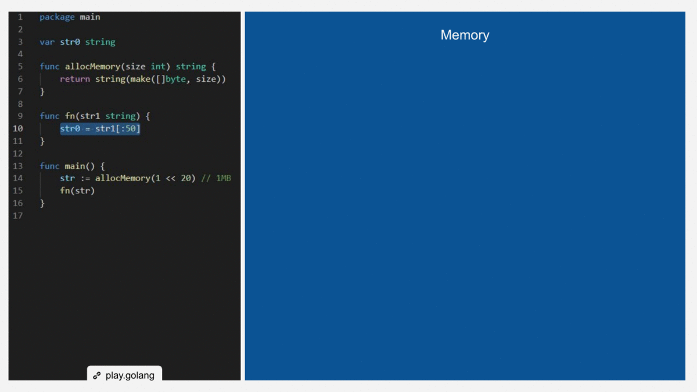

# Memory Leaking

_Memory leak_ is the name is given when a block of memory, allocated for a given operation, is not released when it is no longer needed. A memory leak can also happen when an object is stoted in memory but can no longer be accessed anymore by the running code.

This [post blog](https://medium.com/dm03514-tech-blog/sre-debugging-simple-memory-leaks-in-go-e0a9e6d63d4d) describes in detail the memory leak.

**Table of Contents**

- [Garbage Collection](#garbage-collection)
- [Scenarios](#scenarios)
  - [Caused by Substrings](#caused-by-substrings)

## Garbage Collection

Generally, when programming in a language that supports automatic garbage collection, we do not have to worry about memory leaking problems, as regular cleaning of unused memory will be performed. However, we must keep in mind some special scenarios that can cause a memory leak. Next, we'll look at some scenarios.

To understand about memory management in Go and the garbage collector see [here](https://deepu.tech/memory-management-in-golang/).

## Scenarios

### Caused by Substrings
_see the code [here](causedbysubstring.go)_

The Go standard compiler/runtime allows a `s` string and an `s` substring to share the same underlying memory block. This is very good for saving memory and processing. But it can sometimes cause a memory leak.

For example, after the function `CausedBySubstring` in the following example is called, there will be about 1MB memory leaking, until the package-level variable `str0` is modified again elsewhere.

```Go
var str0 string

func CausedBySubstring() {
	str := allocMemory(1 << 20) // 1MB
	fn(str)
}

func allocMemory(size int) string {
	return string(make([]byte, size))
}

func fn(str1 string) {
	str0 = str1[:50]
}
```



I will show you some ways to avoid this memory leaking.

Te first way is to convert the substring `str1` to a `[]byte` value then convert the `[]byte` value back to `string`.

```Go
func fnFix1(str1 string) {
	str0 = string([]byte(str1[:50]))
}
```

The disadvantage of avoiding memory leaking the above way is that we duplicate the 50 bytes unnecessarily.


There is a way to avoid the unnecessary duplicate using the `strings.Builder`.

```Go
func fnFix2(str1 string) {
	var b strings.Builder
	b.Grow(50)
	b.WriteString(str1[:50])
	str0 = b.String()
}
```

The disadvantage of the above way is it is a little verbose.


Finally, we can use the [`strings.Repeat`](https://golang.org/pkg/strings/#Repeat). Since the Go 1.12, we can call the `strings.Repeat` function with the count argument as 1 in the strings standard package to clone a string, and the implementaion of `strings.Repeat` will make use of `strings.Builder`, to avoid one unnecessary duplicate.
```Go
func fnFix3(str1 string) {
	str0 = strings.Repeat(str1[:50], 1)
}
```
